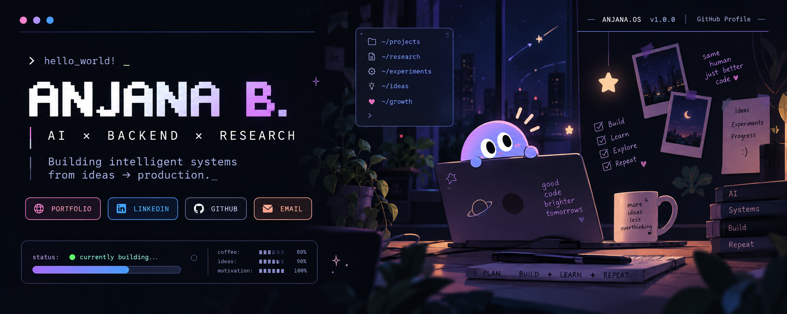

<p align="center">
  
</p>

## `> whoami`

```yaml
name: Anjana B.
focus: AI × Backend × Research

currently:
  - building intelligent systems
  - exploring agentic AI
  - experimenting with multi-agent architectures
  - learning every day
```

<br>

## `> tech --stack`

<p align="left">
  
</p>

<br>

## `> ls ./selected-builds`

### ✦ Stellaris AI

> AI-powered recruitment platform leveraging Large Language Models.

`LLMs` · `LLaMA` · `Python` · `NLP`

---

### ✦ NeuroWeave

> Deep-learning based exploration of neurological connectivity.

`Deep Learning` · `AI` · `Research`

---

### ✦ FoodSnapAI

> Intelligent food analysis powered by computer vision.

`Computer Vision` · `Machine Learning` · `Python`

<br>

## `> cat ./research/published.txt`

```text
╭──────────────────────────────────────────╮
│                                          │
│             PUBLISHED WORK               │
│                                          │
│              STELLARIS AI                │
│             IEEE ICCPCT 2025             │
│                                          │
│       project → research → paper          │
│                                          │
╰──────────────────────────────────────────╯
```

<br>

## `> system.status`

```text
learning    ████████████████████  100%
building    █████████████████░░░   85%
ideas       ███████████████████░   95%

status      ● ONLINE
```

<div align="center">

### `> ./next`

*Still learning. Still building.*

**Probably debugging something right now.**

`◉‿◉`

</div>
